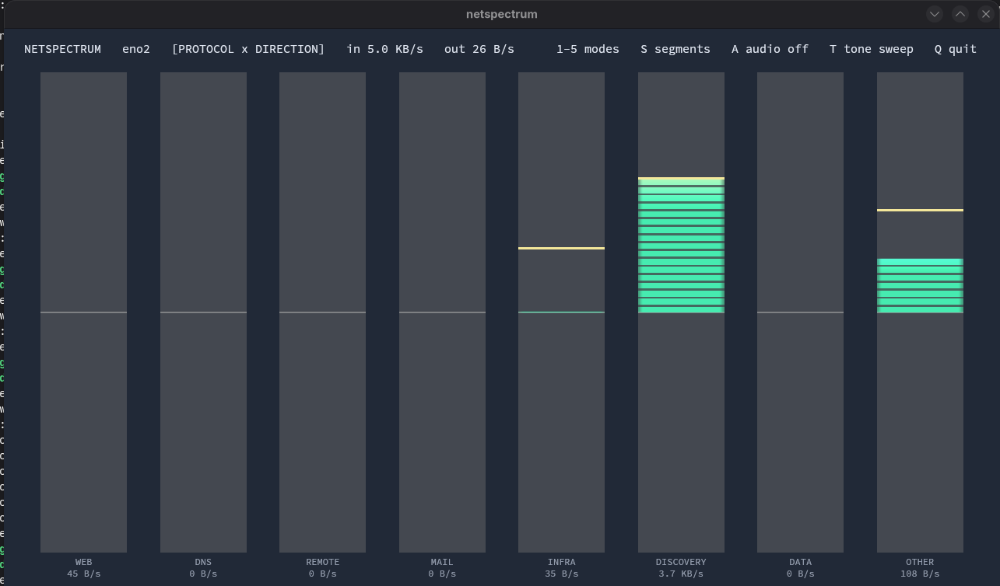

# netspectrum

A GPU-accelerated graphic equaliser for your network interface. Passively
observes traffic on the wire (never transmits a single packet, never captures
payloads — snaplen is 96 bytes, headers only) and renders it as a dancing,
LED-segmented spectrum with real audio-analyser ballistics: fast attack, slow
release, and peak-hold caps that hang and fall.

This is a bit of fun, not a serious network monitoring or security tool. Treat
it as a playful way to make traffic visible and audible, not as something to
base operational decisions on.

## Screenshot

<p align="center">
  
</p>

## Build

Requires Rust (any recent toolchain; the committed `Cargo.lock` also keeps it
buildable on distro rustc 1.75) and libpcap headers:

```
sudo apt install libpcap-dev        # Debian/Ubuntu
sudo dnf install libpcap-devel      # Fedora
cargo build --release
```

The binary lands at `target/release/netspectrum`. Rendering uses wgpu, which
picks Vulkan on Linux automatically (GL fallback if needed).

## Run

Capture needs raw-socket rights. Either:

```
sudo ./target/release/netspectrum -i eth0
```

or grant the capability once and run as yourself:

```
sudo setcap cap_net_raw,cap_net_admin+ep target/release/netspectrum
./target/release/netspectrum -i eth0
```

With no `-i`, the default interface is used. `--list` shows interfaces.

## Views

Choose at launch with `-m`, or hot-switch live with the number keys:

| Key | Mode       | Bands represent                                            |
|-----|------------|------------------------------------------------------------|
| 1   | `protocol` | 18 protocol bands: ARP, ICMP, DHCP, NTP, DNS, mDNS/SSDP, HTTP, TLS, QUIC, SSH, RDP/VNC, SMB/NFS, MAIL, DB, SYSLOG, other TCP/UDP/other |
| 2   | `ports`    | 16 log2-spaced service-port bins — a true "frequency spectrum" of ports |
| 3   | `hosts`    | Top remote hosts by traffic, dynamically ranked with hysteresis so bars don't reshuffle |
| 4   | `hybrid`   | 8 protocol groups, mirrored around a centre line — inbound rises (cyan), outbound falls (orange) |
| 5   | `sizes`    | Packet-size histogram: tiny ACKs on the left, full-MTU bulk transfer on the right |

## Controls

| Key       | Action                                                  |
|-----------|---------------------------------------------------------|
| `1`-`5`   | Switch between the live views listed above              |
| `B`       | Use the classic bar renderer                            |
| `F`       | Use the fireworks renderer                              |
| `R`       | Use the radar / sonar renderer                          |
| `M`       | Use the matrix-rain renderer                            |
| `O`       | Use the oscilloscope renderer                           |
| `P`       | Use the pulse-ring renderer                             |
| `G`       | Use the galaxy / orbit renderer                         |
| `L`       | Use the lightning renderer                              |
| `Y`       | Cycle the visual colour palette                         |
| `H`       | Cycle HUD detail: full, compact, clean visual-only      |
| `S`       | Toggle LED segmentation on the bars                     |
| `A`       | Toggle optional audio feedback                          |
| `T`       | Cycle through the tone palettes                         |
| `W`       | Toggle the window frame and titlebar controls           |
| `Z`       | Toggle the dark-blue background transparency            |
| `X`       | Toggle the grey bar backing transparency                |
| `Q`/`Esc` | Quit                                                    |

Known issue: on some Linux desktops the second `W` press can hide the equaliser
instead of restoring the frame; this is tracked in issue #16.

## Reading it

* Bar height is **log-scaled bytes/sec** with slow-decaying auto-gain, so both
  an idle home link and a saturated 10G port look right without configuration.
* The default `B` renderer is the classic bar view. The `F` renderer keeps the
  same bands but turns each band's traffic intensity into expanding firework
  bursts with dense bright particles, larger size, and stronger glow as traffic
  gets louder.
* Extra visual renderers are available with `R` radar, `M` matrix rain, `O`
  oscilloscope, `P` pulse rings, `G` galaxy, and `L` lightning. They use the
  same band data as the bars, so the view changes but the underlying traffic
  grouping stays the same.
* The particle renderers add motion-blur trail dots and soft bloom-style layers
  around brighter traffic. Press `Y` to cycle between the neon, solar, aurora,
  and candy visual palettes.
* Press `H` to cycle the on-screen text between full header plus band labels,
  compact header only, and a clean visual-only view.
* The colour ramp (green → amber → red) tracks each band's fraction of the
  current full-scale reference — red means "loud relative to recent history".
* Gold caps are peak-hold markers: they hang ~1.1 s, then fall.
* Optional audio follows the current system default output through `pw-cat`
  with `pacat` fallback. Volume and routing stay under your desktop/system
  audio controls. In the mirrored hybrid view, inbound and outbound use separate
  tones so outbound traffic keeps its negative-flow character.
* Tone palettes are deliberately playful:

| Tone     | Character                                      |
|----------|------------------------------------------------|
| `sweep`  | Smooth analyzer-style pitch sweeps             |
| `chime`  | Brighter glassy tones for lighter traffic      |
| `pulse`  | Lower, heavier pulses for busy flows           |
| `arcade` | Quantized blips with stepped pitch movement    |

* Under each band: its name and a smoothed live rate. The header shows total
  in/out throughput.

## Useful flags

```
-f, --filter <BPF>   e.g. -f 'not port 22' to hide the SSH session you're watching from
    --hosts <N>      band count in hosts mode (4-24, default 12)
    --audio-output <TARGET>
                     optional PipeWire/Pulse sink target, e.g. an HDMI sink name
-m, --mode <MODE>    initial view (protocol|ports|hosts|hybrid|sizes)
    --list           list capture interfaces and exit
```

## Notes

* Passive only: the pcap handle is opened for capture; nothing is ever sent.
* This is intentionally decorative and approximate. It does not replace packet
  analysis, flow accounting, alerting, observability, or security monitoring.
* Promiscuous mode is requested; on a switched network you'll mostly see your
  own host's traffic plus broadcast/multicast unless you're on a mirror/SPAN port.
* Direction detection uses the interface's own addresses; traffic not involving
  a local address counts as inbound.
* If `A` shows `audio n/a`, check that PipeWire/PulseAudio is running and that
  `pw-cat` or `pacat` is installed. If you run netspectrum with `sudo`, audio is
  started against the original user session when `SUDO_UID`/`SUDO_GID` are
  available. To force HDMI or another sink, pass `--audio-output <TARGET>` using
  a sink name from `wpctl status` or `pactl list short sinks`.
